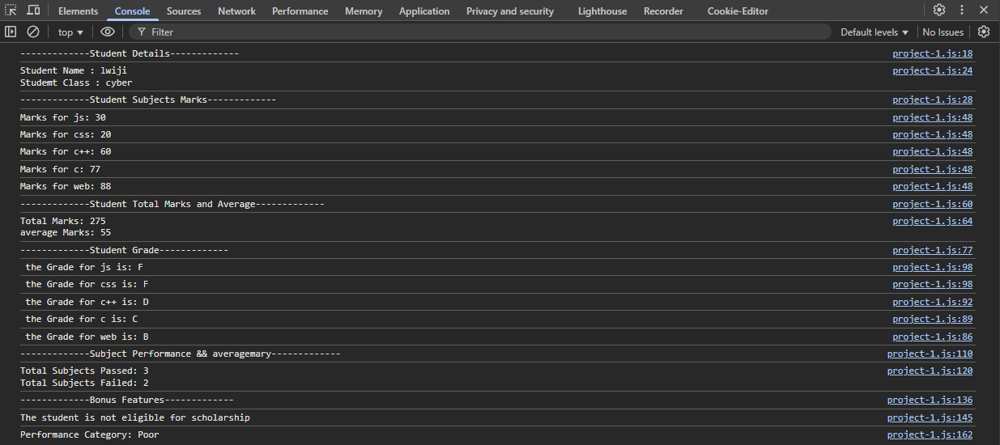
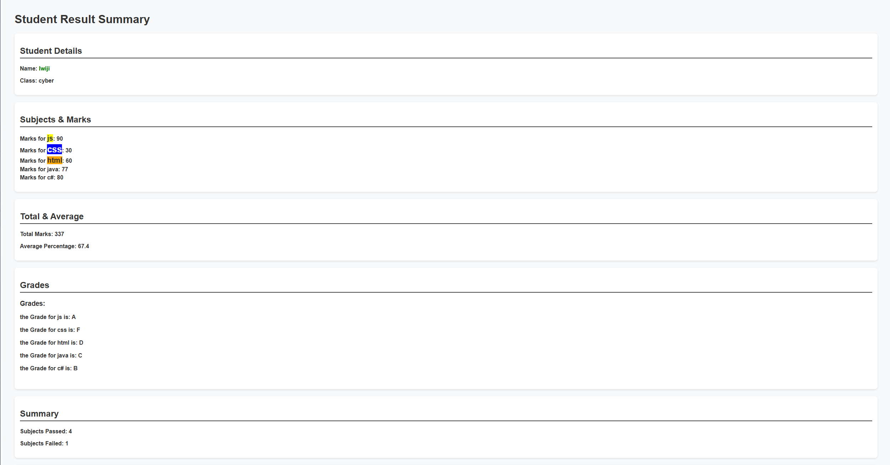

# First-Project:

very simple project it coloect input using prompt and the output from console

[Project1-JS-FILE](project-1.js/)

---

# Second-Project:

same project put i did some improvment on it :)

[Project2-JS-FILE](project-2/project-2.js)
